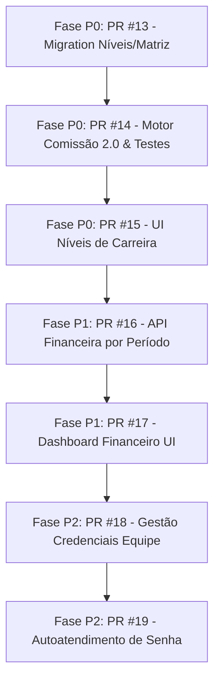

# AUDITORIA E BLUEPRINT TÉCNICO: COMISSÃO 2.0, FINANCEIRO E EQUIPE / ACESSO

> **Status:** AUDITORIA CONCLUÍDA / BLUEPRINT TÉCNICO E DE PRODUTO  
> **Projeto:** Tem Barber  
> **Data:** 22/07/2026  
> **Diretrizes de Segurança Cumpridas:** Nenhuma alteração de código, migração, commit ou alteração de ambiente foi realizada nesta etapa.

---

## 1. RESUMO EXECUTIVO

A produção atual do **Tem Barber** encontra-se estável após as entregas estratégicas recentes (PR #10 WhatsApp semiautomático, PR #11 Logout público, PR #12 Fluxo Admin Confirmação e Hotfix de datas).

Para suportar o crescimento dos estabelecimentos parceiros e profissionalizar a gestão financeira e de equipes, realizou-se uma auditoria profunda do código-fonte, esquemas de dados (Prisma) e fluxos operacionais nos três pilares centrais:

1. **Comissão (Atualmente em V1):** Possui boa rastreabilidade operacional e integração com Comandas e Clube, porém peca por exigência de configuração individual manual por barbeiro/serviço, gerando sobrecarga administrativa e ausência de **Planos de Carreira (Níveis de Senioridade)** e comissão gerencial flexível.
2. **Financeiro (Atualmente V1 Monodia):** Restrito à visão de um único dia por vez. Não contempla DRE simplificada, filtro por períodos (semana, mês, intervalo customizado), fluxo de caixa acumulado, nem a integração automática das comissões e custos de mercadorias no resultado operacional da barbearia.
3. **Equipe e Controle de Acesso:** Possui estrutura base `User` + `BarbershopMember`, mas apresenta lacunas de autoatendimento (ausência de alteração de senha pelo próprio usuário, ausência de reset/recuperação de senha), impossibilidade de o Owner atualizar e-mail de colaboradores e riscos de gestão de acessos.

Este documento apresenta a **Auditoria Completa** e o **Blueprint de Arquitetura e Produto** para implementação segura, organizada em fases prioritárias (**P0, P1, P2**) divididas em PRs atômicos com plano de regressão zero.

---

## 2. ESTADO ATUAL DA COMISSÃO

### 2.1. Arquitetura e Modelos prisma
A comissão é sustentada por quatro tabelas no `prisma/schema.prisma`:
*   `CommissionConfig`: Guarda as regras configuradas por barbearia (`scopeKey` com suporte a `memberId`, `serviceId`, `categoryId`, `productId`, `default`).
*   `CommissionEntry`: Registro financeiro individual gerado a partir de cada `ComandaItem` pago ou liberado.
*   `CommissionPeriod`: Consolidação mensal (`competence` YYYY-MM) por membro com status (`OPEN`, `CLOSED`, `PAID`).
*   `CommissionAdjustment`: Lançamentos de liberação (`RELEASE`), estorno (`REVERSAL`) ou saldo acumulado negativo (`PAID_ADJUSTMENT`).

### 2.2. Respostas Objetivas à Auditoria de Comissão
1.  **Onde a comissão é configurada hoje?**  
    Na página `/admin/comissoes/configuracoes` (API `/api/admin/commissions/configs`), gravando na tabela `commission_configs`.
2.  **É por profissional, serviço, tenant ou global?**  
    Atualmente suporta hierarquia dinâmica em `CommissionConfig` via `scopeKey`:  
    `Membro+Serviço` > `Membro+Categoria` > `Membro+Produto` > `Membro Default` > `Serviço` > `Categoria` > `Produto` > `Barbearia Default`.
3.  **Comissão usa valor bruto ou líquido?**  
    Usa o **valor líquido** do item na comanda após abater descontos diretos do item e após a partição proporcional dos descontos globais aplicados na comanda (`generateCommissionsForComanda`).
4.  **Desconto reduz comissão?**  
    **Sim.** Descontos diretos ou globais da comanda reduzem proporcionalmente a `baseAmount` calculada para a comissão.
5.  **Plano Clube reduz comissão?**  
    Serviços 100% cobertos pelo Clube (`INCLUDED_SERVICE`) **não geram** `CommissionEntry` tradicional (são remunerados via rateio do fundo de pontos do Clube em `ClubSettlement`). Serviços com desconto percentual (`SERVICE_DISCOUNT`) geram comissão sobre a base líquida efetivamente paga pelo cliente.
6.  **Produto gera comissão?**  
    **Sim**, se houver regra configurada para produto (específico ou padrão de produto). O executor padrão é o barbeiro do agendamento ou o selecionado no item da comanda.
7.  **Serviço cancelado gera comissão?**  
    **Não.** Quando um item ou comanda passa para `CANCELLED`, o sistema executa o estorno (`reverseCommissionEntry`), zerando a comissão liberada (`status: REVERSED` / `releasedAmount: 0`).
8.  **Reembolso/refund estorna comissão?**  
    **Sim.** Quando ocorre reembolso (`Payment.status = REFUNDED`), a função `syncCommissionReleaseForComanda` recalcula o valor pago líquido e ajusta proporcionalmente a comissão liberada. Caso a comissão já tenha sido paga ao barbeiro em período fechado, o sistema gera um `CommissionAdjustment` do tipo `PAID_ADJUSTMENT` negativo com saldo acumulado (*rollover*) para a competência seguinte.
9.  **Existe relatório por período?**  
    **Sim**, agrupado por mês de competência (`YYYY-MM`) via `CommissionPeriod` e detalhado em `/admin/comissoes` e `/admin/comissoes/periodos`.
10. **Existe recalculo?**  
    **Sim.** A função `syncOpenCommissionPeriod` recalcula automaticamente os totais gerados, liberados, pagos e o saldo a pagar sempre que o período está com status `OPEN`.
11. **Quais tabelas guardam comissão?**  
    `commission_configs`, `commission_entries`, `commission_periods`, `commission_adjustments`.
12. **Quais riscos existem hoje?**  
    *   **Rigidez de Configuração:** Não existe conceito de Nível de Carreira (`CareerLevel`). Alterar a comissão de uma equipe inteira exige cadastrar regras individuais por barbeiro.
    *   **Falta de Comissão Gerencial:** Gerentes não possuem mecanismo nativo para comissionamento sobre a produção da equipe ou faturamento da loja.

---

## 3. PROBLEMAS DA COMISSÃO ATUAL

1.  **Falta de Matriz Serviço x Nível de Senioridade:** Impossibilita modelos comerciais comuns em barbearias (ex: Barbeiro Júnior ganha 30% em Corte, Pleno 40%, Sênior 50%).
2.  **Manutenibilidade Crítica:** Em uma barbearia com 10 barbeiros e 20 serviços, a falta de matriz por nível exige até 200 regras em `CommissionConfig`.
3.  **Tratamento de Gerentes Inexistente:** Não há cálculo de sobre-comissão (*override*) para gerentes sobre faturamento geral da unidade ou equipe.

---

## 4. PROPOSTA COMISSÃO 2.0

Proposta de arquitetura para a **Comissão 2.0 por Matriz e Regra Flexível**:

### Matriz de Comissão Base
A comissão do profissional será resolvida prioritariamente pela combinação:
$$\text{serviceId} + \text{careerLevelId} = \text{commissionRate}$$

### Cadeia de Fallback Inquebrável (Backward Compatibility)
Para garantir que **nenhuma barbearia existente pare de calcular comissão**, a resolução da comissão seguirá a ordem de prioridade:
1.  **Matriz Nível x Serviço** (`ServiceCommissionRule` ativa para `serviceId` + `careerLevelId` do profissional).
2.  **Configuração de Sobrescrita Individual por Membro** (`CommissionConfig` com `memberId` + `serviceId`).
3.  **Configuração Padrão do Serviço** (`CommissionConfig` com `serviceId`).
4.  **Configuração Padrão do Nível** (`CareerLevel.defaultCommissionRate`).
5.  **Configuração Padrão da Barbearia** (`CommissionConfig` com `scopeKey = barbershop:default`).

---

## 5. PLANO DE CARREIRA / NÍVEIS (CAREER LEVEL)

### 5.1. Modelagem Proposta
Não existem tabelas de senioridade no schema atual. Propõe-se a criação dos modelos:

```prisma
model CareerLevel {
  id                    String   @id @default(uuid())
  barbershopId          String   @map("barbershop_id")
  name                  String   // Ex: "Treinamento / Aprendiz", "Profissional", "Sênior", "Master"
  description           String?
  sortOrder             Int      @default(0) @map("sort_order")
  defaultCommissionRate Decimal? @map("default_commission_rate") @db.Decimal(5, 2)
  active                Boolean  @default(true)
  createdAt             DateTime @default(now()) @map("created_at")
  updatedAt             DateTime @updatedAt @map("updated_at")

  barbershop Barbershop               @relation(fields: [barbershopId], references: [id], onDelete: Cascade)
  members    BarbershopMember[]
  rules      ServiceCommissionRule[]

  @@unique([barbershopId, name])
  @@index([barbershopId, active])
  @@map("career_levels")
}

model ServiceCommissionRule {
  id             String               @id @default(uuid())
  barbershopId   String               @map("barbershop_id")
  serviceId      String               @map("service_id")
  careerLevelId  String               @map("career_level_id")
  type           CommissionConfigType @default(PERCENTAGE)
  commissionRate Decimal              @map("commission_rate") @db.Decimal(10, 2)
  active         Boolean              @default(true)
  createdAt      DateTime             @default(now()) @map("created_at")
  updatedAt      DateTime             @updatedAt @map("updated_at")

  barbershop  Barbershop  @relation(fields: [barbershopId], references: [id], onDelete: Cascade)
  service     Service     @relation(fields: [serviceId], references: [id], onDelete: Cascade)
  careerLevel CareerLevel @relation(fields: [careerLevelId], references: [id], onDelete: Cascade)

  @@unique([barbershopId, serviceId, careerLevelId])
  @@index([barbershopId, serviceId])
  @@index([barbershopId, careerLevelId])
  @@map("service_commission_rules")
}
```

E a adição da chave estrangeira opcional em `BarbershopMember`:
```prisma
// Em BarbershopMember:
careerLevelId String?      @map("career_level_id")
careerLevel   CareerLevel? @relation(fields: [careerLevelId], references: [id], onDelete: SetNull)
```

---

## 6. COMISSÃO DE GERENTE

### 6.1. Análise de Modalidades
A comissão gerencial pode ocorrer por:
1.  **Produção Própria:** Comissão regular sobre atendimentos executados pelo próprio gerente.
2.  **Percentual do Faturamento da Equipe/Loja:** Sobrescrita de 1% a 5% sobre a receita bruta ou líquida dos serviços executados pela equipe supervisionada.
3.  **Bônus por Atingimento de Meta:** Lançamento fixo de bônus condicionado ao atingimento de metas da unidade.

### 6.2. Recomendação de Produto e Risco
*   **Decisão Recomendada:** **NÃO incluir comissão de gerente no MVP P0.**
*   **Motivo:** A inclusão de comissão gerencial com base em equipe no mesmo ciclo do P0 adicionaria complexidade de múltiplos beneficiários para um único `ComandaItem` ou exigiria rotinas de fechamento com duplo rateio.
*   **Encaminhamento:** O P0 focará 100% na **Comissão por Matriz de Senioridade (Career Level)** para barbeiros. A comissão de gerente será especificada como extensão do P1/P2 após a consolidação da matriz.

---

## 7. ESTADO ATUAL DO FINANCEIRO

### 7.1. Respostas Objetivas à Auditoria do Financeiro
1.  **O financeiro hoje mostra só dia?**  
    **Sim.** A tela `/admin/financeiro` e a API `/api/admin/financial/daily-summary` exigem o parâmetro `date` (YYYY-MM-DD) e calculam métricas exclusivamente para aquele dia UTC.
2.  **Existe visão semana/mês/período?**  
    **Não.** Não há seletores de intervalo de datas (Data Inicial / Data Final) nem agregadores semanais ou mensais.
3.  **Existe fluxo de caixa?**  
    Existe controle individual de sessão de caixa de terminal (`CashSession` e `CashMovement` em `/admin/caixa`), mas **não há visão consolidada** de fluxo de caixa acumulado por período.
4.  **Existe DRE simplificada?**  
    **Não.** Não existe relatório de DRE com segregação de Receita Bruta, Descontos, Receita Líquida, Custos Operacionais (Comissões) e Margem de Contribuição.
5.  **Existe contas a pagar?**  
    **Não.** Existem apenas lançamentos de saída manual avulsa (`MANUAL_OUT` em `FinancialEntry`). Não há gestão de fornecedores, contas agendadas ou datas de vencimento.
6.  **Existe contas a receber?**  
    Há apenas a medição do saldo pendente em comandas abertas (`remainingTotal`), sem gestão de parcelamentos ou fiado.
7.  **Existe relatório por forma de pagamento?**  
    **Sim (apenas diário).** O `daily-summary` agrupa pagamentos em `CASH`, `PIX`, `DEBIT`, `CREDIT`, `OTHER`.
8.  **Comissão entra como custo?**  
    **Não.** As comissões liberadas/pagas ficam restritas ao módulo de comissões e não são deduzidas do saldo líquido exibido na tela financeira.
9.  **Produtos/estoque entram?**  
    A venda bruta do produto via comanda entra no faturamento. No entanto, o custo de aquisição (`Product.costPrice`) ou o CMV **não é abatido** do resultado financeiro.
10. **Quais dados já existem e podem ser reaproveitados?**  
    *   `Payment`: Valores pagos, datas, métodos, estornos.
    *   `Comanda` / `ComandaItem`: Detalhes de vendas por serviço e produto.
    *   `FinancialEntry`: Entradas e saídas avulsas manuais.
    *   `CommissionEntry`: Comissões geradas e liberadas por período.
    *   `ClubSubscriptionPayment`: Receitas de mensalidades do Clube.

---

## 8. PROPOSTA FINANCEIRO BÁSICO DE GESTÃO

Substituição da visão restrita de "um único dia" por um **Dashboard Financeiro Consolidado por Período**:

### 8.1. Métricas Principais do Período (Filtro Data Inicio -> Data Fim)
*   **Faturamento Bruto:** Soma de todas as comandas e assinaturas pagas no período.
*   **Descontos Concedidos:** Total de descontos aplicados em comandas e itens.
*   **Faturamento Líquido:** Faturamento Bruto $-$ Descontos Concedidos.
*   **Total Recebido (Efetivo em Caixa/Bancos):** Soma de `Payment` (CONFIRMED) + Entradas Manuais.
*   **A Receber:** Soma de `remainingTotal` de comandas abertas/em atendimento no período.
*   **Despesas / Saídas Manuais:** Soma de `FinancialEntry` (MANUAL_OUT) + Estornos.
*   **Custo Estimado de Comissões:** Total de `CommissionEntry.releasedAmount` referente às comandas do período.
*   **Resultado Operacional Estimado:** 
    $$\text{Resultado} = \text{Total Recebido} - \text{Despesas} - \text{Comissões Liberadas}$$

### 8.2. Visões e Gráficos do Dashboard Financeiro
1.  **Breakdown por Forma de Pagamento:** Totais e % (Pix, Cartão de Crédito, Cartão de Débito, Dinheiro, Outros).
2.  **Top Serviços em Receita:** Ranking dos serviços mais rentáveis.
3.  **Top Profissionais em Faturamento:** Ranking de produção por barbeiro.
4.  **Extrato de Movimentações:** Tabela unificada paginada de entradas, saídas, estornos e sangrias.

---

## 9. ESTADO ATUAL DE EQUIPE / ACESSO

### 9.1. Respostas Objetivas à Auditoria de Equipe/Acesso
1.  **Onde fica salvo o e-mail do barbeiro?**  
    Na tabela `User` (`users.email`), associado ao `BarbershopMember` via `userId`.
2.  **O owner consegue ver/editar esse e-mail?**  
    O Owner consegue **visualizar** na listagem (`/admin/equipe`). Porém, a API de edição (`PUT /api/admin/team/[id]`) **não permite** editar e-mail ou telefone do `User`.
3.  **O barbeiro consegue alterar a própria senha?**  
    **Não.** Não existe tela ou API de autoatendimento para alteração de senha por usuário logado.
4.  **Existe reset password?**  
    **Não.** Não há fluxo automatizado de "Esqueci minha senha" com token por e-mail ou WhatsApp.
5.  **Existe convite por e-mail?**  
    **Não.** O cadastro de colaborador exige que o administrador digite diretamente uma senha inicial no modal.
6.  **Como ativar/inativar barbeiro?**  
    Via `PATCH /api/admin/team/[id]`, alterando o booleano `isActive` em `BarbershopMember`.
7.  **Member e User estão bem ligados?**  
    Estão relacionados via `@unique([barbershopId, userId])`. Se o e-mail/CPF/telefone fornecido já existir no sistema como cliente `User`, o sistema reutiliza o registro e associa o `BarbershopMember`.
8.  **Existe risco de e-mail duplicado?**  
    `User.email` possui restrição `@unique` no PostgreSQL. Tentativas de cadastrar e-mail já existente lançam exceção de unicidade no banco.
9.  **Existe role BARBER corretamente isolada?**  
    O isolamento existe na verificação de sessão (`getAdminSession` / `requireOperationalSession`), mas o controle granular na UI para impedir que barbeiros acessem relatórios financeiros da loja precisa de revisão e reforço nas rotas da API.

---

## 10. PROPOSTA EQUIPE / ACESSO

### 10.1. Regras de Segurança e Autoatendimento
1.  **Proteção de Credenciais:** NUNCA exibir senhas em texto plano na interface ou logs.
2.  **Edição Administrativa pelo Owner:** Permitir que o Owner atualize nome, e-mail, telefone e CPF do membro de sua equipe.
3.  **Redefinição pelo Owner (Reset de Senha Forçado):** Permitir que o Owner defina uma nova senha temporária para o colaborador ou envie um link/token de redefinição via WhatsApp.
4.  **Autoatendimento de Senha:** Disponibilizar no perfil do usuário logado (Barbeiro/Gerente/Owner) o formulário "Alterar Minha Senha" (exigindo senha atual + nova senha).
5.  **Proteção de Roles:** Impedir estritamente que usuários com role `BARBER` acessem APIs de resumo financeiro global (`/api/admin/financial/*`) ou configurações da barbearia.

---

## 11. MODELAGEM SUGERIDA (PRISMA SCHEMA DELTA)

```prisma
// ----------------------------------------------------
// NOVOS MODELOS PARA PLANO DE CARREIRA E MATRIZ
// ----------------------------------------------------

model CareerLevel {
  id                    String   @id @default(uuid())
  barbershopId          String   @map("barbershop_id")
  name                  String
  description           String?
  sortOrder             Int      @default(0) @map("sort_order")
  defaultCommissionRate Decimal? @map("default_commission_rate") @db.Decimal(5, 2)
  active                Boolean  @default(true)
  createdAt             DateTime @default(now()) @map("created_at")
  updatedAt             DateTime @updatedAt @map("updated_at")

  barbershop Barbershop               @relation(fields: [barbershopId], references: [id], onDelete: Cascade)
  members    BarbershopMember[]
  rules      ServiceCommissionRule[]

  @@unique([barbershopId, name])
  @@index([barbershopId, active])
  @@map("career_levels")
}

model ServiceCommissionRule {
  id             String               @id @default(uuid())
  barbershopId   String               @map("barbershop_id")
  serviceId      String               @map("service_id")
  careerLevelId  String               @map("career_level_id")
  type           CommissionConfigType @default(PERCENTAGE)
  commissionRate Decimal              @map("commission_rate") @db.Decimal(10, 2)
  active         Boolean              @default(true)
  createdAt      DateTime             @default(now()) @map("created_at")
  updatedAt      DateTime             @updatedAt @map("updated_at")

  barbershop  Barbershop  @relation(fields: [barbershopId], references: [id], onDelete: Cascade)
  service     Service     @relation(fields: [serviceId], references: [id], onDelete: Cascade)
  careerLevel CareerLevel @relation(fields: [careerLevelId], references: [id], onDelete: Cascade)

  @@unique([barbershopId, serviceId, careerLevelId])
  @@index([barbershopId, serviceId])
  @@index([barbershopId, careerLevelId])
  @@map("service_commission_rules")
}

// ALTERAÇÃO EM BarbershopMember:
// Adicionar o campo opcional:
// careerLevelId String? @map("career_level_id")
// careerLevel CareerLevel? @relation(fields: [careerLevelId], references: [id], onDelete: SetNull)
```

---

## 12. APIS E TELAS IMPACTADAS

| Módulo | Tipo | Caminho / Componente | Descrição do Impacto |
| :--- | :--- | :--- | :--- |
| **Comissão / Carreira** | API | `GET/POST /api/admin/career-levels` | CRUD de Níveis de Carreira da barbearia |
| **Comissão / Carreira** | API | `GET/PUT /api/admin/career-levels/rules` | Gestão da Matriz Nível x Serviço |
| **Comissão** | Engine | `src/lib/operations/commissions.ts` | Atualização da função `resolveCommissionConfig` para incorporar o fallback da matriz |
| **Comissão / Carreira** | Tela | `src/app/admin/comissoes/niveis/page.tsx` | Interface para cadastro de Níveis e configuração da Matriz visual |
| **Financeiro** | API | `GET /api/admin/financial/summary` | Substitui o daily-summary por busca por período (startDate, endDate) com DRE |
| **Financeiro** | Tela | `src/app/admin/financeiro/page.tsx` | Dashboard financeiro completo com date-range picker e cards de resultado |
| **Equipe** | API | `PUT /api/admin/team/[id]` | Expansão para atualização de dados cadastrais (e-mail, telefone, CPF, levelId) |
| **Equipe** | API | `POST /api/admin/team/[id]/reset-password` | Rota para Owner redefinir senha de colaborador |
| **Perfil Usuário** | API | `POST /api/user/change-password` | Autoatendimento de troca de senha própria |
| **Equipe** | Tela | `src/app/admin/equipe/page.tsx` | Inclusão do seletor de Nível de Carreira no modal e ações de segurança |

---

## 13. MATRIZ DE PRIORIZAÇÃO E PRs RECOMENDADOS

### 13.1. Classificação de Prioridades

#### **P0 — Comissão 2.0 & Plano de Carreira (Risco / Core)**
*   **Impacto:** ALTO. Resolve a sustentabilidade das regras operacionais sem romper comissões ativas.
*   **Risco:** MÉDIO. Exige migração de banco limpa (novas tabelas + campo nullable) e atualização do motor de cálculo.
*   **Sugestão de PRs:**
    *   **PR #13 (P0.1):** `schema & migration` — Criação das tabelas `CareerLevel`, `ServiceCommissionRule` e FK em `BarbershopMember`.
    *   **PR #14 (P0.2):** `commission engine` — Atualização de `resolveCommissionConfig` em `commissions.ts` com suporte à matriz e suite completa de testes de integração sem regressão.
    *   **PR #15 (P0.3):** `career UI & team assignment` — Telas de gestão de níveis/matriz e vínculo do nível no cadastro do barbeiro.

#### **P1 — Financeiro de Gestão por Período (Visibilidade / Negócio)**
*   **Impacto:** ALTO. Entrega visibilidade real de lucratividade para os donos de barbearia.
*   **Risco:** BAIXO. Não altera dados operacionais de vendas, apenas consulta e consolida movimentações existentes.
*   **Sugestão de PRs:**
    *   **PR #16 (P1.1):** `financial range API` — Nova API de resumo por período com DRE simplificada e integração de custos de comissão.
    *   **PR #17 (P1.2):** `financial dashboard UI` — Interface renovada com filtro por período, gráficos e rankings.

#### **P2 — Equipe, Segurança e Gestão de Senhas (Usabilidade / Autoatendimento)**
*   **Impacto:** MÉDIO. Elimina dependência de suporte manual para ajuste de e-mails e senhas de colaboradores.
*   **Risco:** BAIXO.
*   **Sugestão de PRs:**
    *   **PR #18 (P2.1):** `team credentials management` — Edição de e-mail/telefone pelo Owner e reset administrativo de senha.
    *   **PR #19 (P2.2):** `user password self-service` — Tela/modal de alteração da própria senha no perfil do usuário e endurecimento de permissões por role.

---

## 14. ANÁLISE DE RISCOS

1.  **Risco de Regressão em Comissões Existentes:**
    *   *Mitigação:* O motor de cálculo testará em ordem rígida. Caso um barbeiro não tenha `careerLevelId` ou a matriz não tenha regra para determinado serviço, o sistema recorre automaticamente aos registros de `CommissionConfig` já existentes.
2.  **Concorrência na Edição de Níveis em Horário de Funcionamento:**
    *   *Mitigação:* A comissão é gravada na comanda com foto imutável em `configSnapshot` no momento da geração/fechamento. Alterações de matriz afetam apenas vendas futuras.
3.  **Inconsistência de Fuso Horário em Consultas Financeiras por Período:**
    *   *Mitigação:* Padronizar todas as datas de início e fim no backend em formato UTC (ex: `00:00:00.000Z` até `23:59:59.999Z` da data local da barbearia).

---

## 15. ORDEM RECOMENDADA DE EXECUÇÃO



---

## 16. RECOMENDAÇÃO GO / NO-GO

> **PARECER DA AUDITORIA: GO COM EXECUÇÃO FASEADA**
>
> A base de código do **Tem Barber** está extremamente bem estruturada em termos de isolamento de operações (`src/lib/operations/`), transações do Prisma e idempotência. 
> 
> A implementação da **Comissão 2.0 por Matriz** e do **Financeiro por Período** é totalmente viável sem quebras ou indisponibilidade, desde que seguidos estritamente os PRs isolados conforme especificado neste blueprint.

---

## 17. DECISÃO PR #13

* **Escopo:** O PR #13 cria estritamente a base de dados (`CareerLevel`, `ServiceCommissionRule` e a chave opcional `careerLevelId` em `BarbershopMember`), além da migration SQL não-destrutiva `20260722152000_add_career_levels_and_service_commission_rules`.
* **Motor de Comissão:** A engine de cálculo de comissão NÃO foi alterada neste PR e virá no **PR #14**.
* **Interface de Usuário:** Nenhuma tela foi alterada neste PR e a UI dos Níveis de Carreira virá no **PR #15**.
* **Ordem de Fallback Documentada:** A ordem futura de resolução preserva todas as exceções individuais existentes antes de consultar a matriz:
  1. Member + Service (`CommissionConfig`)
  2. Member + Category (`CommissionConfig`)
  3. Member default (`CommissionConfig`)
  4. Service + Level (`ServiceCommissionRule`)
  5. Service default (`CommissionConfig`)
  6. Category default (`CommissionConfig`)
  7. Product default (`CommissionConfig`)
  8. Level default (`CareerLevel.defaultCommissionRate`)
  9. Barbershop default (`CommissionConfig`)
* **Garantia de Não-Regressão:** Nenhuma comissão existente é afetada por este PR.

