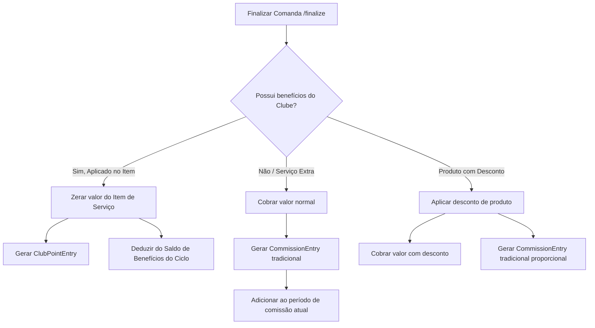

# Tem Barber — Plano Clube

## 1. Definição

O **Plano Clube** (ou Plano de Assinatura de Clientes) é um módulo operacional que permite a cada barbearia (tenant) do Tem Barber criar, vender e gerenciar planos de assinatura recorrentes para seus **próprios clientes finais**.

> [!IMPORTANT]
> **Atenção Conceitual:** Este módulo é totalmente voltado para a operação final da barbearia. Ele **NÃO** tem relação com as assinaturas da plataforma Tem Barber, **NÃO** afeta `/admin/platform`, **NÃO** utiliza o model `TenantSubscription` e **NÃO** se confunde com o plano que o proprietário da barbearia paga para utilizar o SaaS.

---

## 2. Conceito Operacional

O proprietário da barbearia poderá estruturar planos customizados contendo:
* **Identificação:** Nome, descrição e status (ativo/inativo).
* **Precificação:** Valor da mensalidade (cobrado por ciclo, inicialmente mensal).
* **Benefícios de Serviços Inclusos:** Quantidade limitada de execuções de determinados serviços dentro do ciclo (Ex: 4 cortes/mês).
* **Benefícios de Descontos:** Percentual de desconto em outros serviços ou produtos (Ex: 20% de desconto em hidratação, 10% em shampoos).
* **Pesos/Pontuação por Serviço:** Pontos atribuídos a cada serviço executado sob a cobertura do plano (usado para o rateio dos barbeiros).
* **Configuração de Rateio:** Percentual de receita retida pela barbearia e percentual destinado ao fundo dos barbeiros.
* **Status da Assinatura do Cliente:** Regras para vigência e uso dos benefícios.

---

## 3. Exemplo Prático

A barbearia parceira **Don Brio** cria o plano **"Clube Corte Premium"** com as seguintes especificações:

* **Mensalidade:** R$ 149,90/mês.
* **Serviços Inclusos por Ciclo:**
  * 4 Cortes (Peso: 1,0 ponto por execução)
  * 2 Barbas (Peso: 0,8 ponto por execução)
  * 1 Sobrancelha (Peso: 0,4 ponto por execução)
* **Descontos Adicionais:**
  * 20% em Hidratação de Cabelo (serviço extra)
  * 10% na compra de Shampoos e Pomadas (produtos)
* **Distribuição de Fundo:**
  * 50% retido pela Barbearia (taxa operacional e custos)
  * 50% destinado ao fundo comum dos barbeiros (`barberPoolAmount`)

---

## 4. Regras Principais

1. **Multi-tenancy:** Cada barbearia cria, visualiza e edita apenas seus próprios planos e assinantes, garantindo isolamento total (`barbershopId`). Toda consulta ou operação referente ao clube **deve obrigatoriamente filtrar** pelo `barbershopId` obtido da sessão operacional autenticada.
2. **Vínculo Explícito de Assinatura:** O model `CustomerClubSubscription` deve possuir obrigatoriamente tanto o `barbershopId` (da barbearia) quanto o `customerId` (apontando diretamente para o `User` do cliente final).
3. **Não-Inferência de Assinatura:** **Nunca** inferir uma assinatura ativa apenas por parâmetros indiretos, como telefone solto, dados de agendamento ou comanda. A validação deve consultar explicitamente a existência de um registro `CustomerClubSubscription` com status ativo na barbearia correspondente.
4. **Assinaturas Multi-tenant:** Um mesmo `User` (cliente final) pode possuir assinaturas ativas em barbearias diferentes de forma concorrente e independente (por exemplo, possuir uma assinatura na barbearia Don Brio e outra na barbearia Zovisk Cortes).
5. **Rateio no lugar de Comissão Tradicional:** Serviços cobertos pela assinatura do cliente (com valor a pagar R$ 0,00) **não geram comissão tradicional**. Em vez disso, geram pontos para o profissional que executou o serviço.
6. **Extras Cobrados Normalmente:** Qualquer serviço executado fora dos limites ou escopo do plano do cliente é cobrado pelo seu valor normal e gera a comissão tradicional parametrizada no sistema.
7. **Produtos com Desconto:** Vendas de produtos com descontos de plano clube geram comissões normais (se configuradas), calculadas proporcionalmente sobre o valor final do produto após o desconto aplicado.
8. **Abatimento na Comanda:** O desconto ou benefício do clube é aplicado de forma granular **por item de comanda** (vinculado a um benefício do plano) e não sobre o total geral.
9. **Auditoria de Uso:** Cada abatimento ou ganho de pontos deve referenciar o item da comanda e a assinatura ativa correspondente para fins de rastreabilidade financeira.

---

## 5. Pontos e Rateio

A divisão do fundo de rateio dos barbeiros é calculada proporcionalmente ao esforço executado (medido por pontos acumulados no ciclo mensal).

### Fórmula do Rateio por Profissional

$$\text{Valor do Barbeiro} = \left( \frac{\text{Pontos Acumulados pelo Barbeiro}}{\text{Total de Pontos do Período}} \right) \times \text{Fundo de Rateio}$$

#### Exemplo Prático de Fechamento:
* **Receita Bruta do Clube no Mês (Assinaturas pagas):** R$ 3.000,00
* **Percentual da Barbearia (50%):** R$ 1.500,00
* **Fundo de Rateio dos Barbeiros (50%):** R$ 1.500,00
* **Desempenho do Mês:**
  * **Barbeiro João:** 40 pontos acumulados
  * **Barbeiro Pedro:** 20 pontos acumulados
  * **Total de Pontos:** 60 pontos
* **Distribuição Final:**
  * **João:** \((40 / 60) \times 1.500 = \text{R\$ } 1.000,00\)
  * **Pedro:** \((20 / 60) \times 1.500 = \text{R\$ } 500,00\)

---

## 6. Fluxo de Comanda com Plano Ativo

Quando um cliente com assinatura ativa é selecionado na comanda:

1. **Alerta de Assinatura:** O sistema destaca visualmente que o cliente possui o plano `"Clube Corte Premium"` ativo e exibe o saldo de benefícios do ciclo atual (ex: `"Cortes: 2/4 restantes"`).
2. **Seleção de Cobertura:** Ao adicionar um item de serviço elegível, o operador pode clicar em `"Cobrir pelo Clube"`.
3. **Zerar Item:** O valor unitário e o total do item na comanda são atualizados para R$ 0,00.
4. **Geração de Registro de Uso e Pontos:**
   - O item não gera `CommissionEntry`.
   - Gera um registro de uso do plano (`ClubBenefitUsage`) consumindo 1 unidade do saldo do ciclo.
   - Gera um lançamento de pontos (`ClubPointEntry`) para o executor configurado.
5. **Item Extra:** Se for adicionado um produto ou um serviço extra não coberto, o valor é somado ao restante a pagar da comanda, aceitando pagamento misto na finalização atômica (`/finalize`).

---

## 7. Comissão Tradicional vs. Rateio do Clube

* **CommissionEntry:** Vinculada a itens cobrados na comanda. Entra na listagem e Drawer tradicional de comissões.
* **ClubPointEntry:** Vinculada estritamente aos serviços cobertos. Usada apenas no módulo de fechamento de clube e rateio.

---

## 8. Status da Assinatura do Cliente

A assinatura de um cliente na barbearia pode passar pelos seguintes estados:

| Status | Permite Benefícios? | Detalhes |
|--------|---------------------|----------|
| **ACTIVE** | Sim | Assinatura paga e em vigência. |
| **GRACE_PERIOD** | Sim (com alerta) | Pendente de pagamento recente, permitido uso por carência temporária configurada. |
| **PAST_DUE** | Depende / Não | Mensalidade atrasada. Acesso bloqueado por padrão até regularização. |
| **SUSPENDED** | Não | Bloqueada administrativamente pelo proprietário. |
| **CANCELED** | Não | Cancelada pelo cliente ou barbearia. Mantém histórico de uso. |
| **EXPIRED** | Não | Período de vigência encerrado sem renovação. |

---

## 9. Faltas, Cancelamentos e Abusos

* **Falta (No-Show):** Um agendamento marcado como `NO_SHOW` não consome saldo de benefícios e **não gera pontos** para o barbeiro.
* **Cancelamento:** Cancelamento de agendamentos não gera lançamentos operacionais no clube.
* **Fechamento Atômico:** Os pontos do barbeiro (`ClubPointEntry`) e o consumo de benefício (`ClubBenefitUsage`) só são gerados no momento exato em que a comanda correspondente é fechada (`CLOSED`) na transação de finalização.
* **Agendamentos Futuros:** O MVP não consome saldo por agendamentos agendados no futuro, apenas pelo serviço efetivamente executado e finalizado na comanda.

---

## 10. Fechamento do Clube

* **Competência:** O fechamento do clube opera de forma mensal (`YYYY-MM`).
* **Receita Acumulada:** Soma de todos os pagamentos de mensalidades (`ClubSubscriptionPayment`) confirmados dentro do mês calendário da competência.
* **Processamento:** O proprietário aciona a apuração mensal. O sistema calcula o fundo de rateio e a divisão dos barbeiros com base em todos os `ClubPointEntry` finalizados na competência.
* **Bloqueio Pós-Fechamento:** Uma vez que um fechamento é aprovado/pago, as pontuações e mensalidades daquela competência são bloqueadas contra alterações. Eventuais ajustes tardios entram como correções na competência seguinte.
* **Carry-Over do Fundo dos Barbeiros:** Se houver receita de mensalidade na competência mas zero pontos/atendimentos do clube, o fundo acumulado não é absorvido pela barbearia. Ele acumula para a competência seguinte como saldo de rateio acumulado (`carryOutAmount` que vira `carryInAmount` no período seguinte).

---

## 11. Escopo do MVP

1. **Gestão de Planos:** Tela admin para criar plano, definir mensalidade, listar benefícios (serviços inclusos, descontos e pontos por serviço).
2. **Gestão de Assinantes:** Cadastro manual de assinantes (vinculando cliente ao plano clube) e controle de status.
3. **Registro de Mensalidade:** Lançamento manual de pagamentos de mensalidades em dinheiro/pix para renovação do ciclo.
4. **Aplicação na Comanda:** Botão para aplicar cobertura do plano clube a serviços elegíveis, zerando o preço do item.
5. **Geração de Pontos:** Lançamento de pontos automático ao fechar comanda com item coberto.
6. **Fechamento e Relatório:** Tela de apuração de competência exibindo total arrecadado, fundo, total de pontos de cada colaborador e valor de repasse proporcional.

---

## 12. Fora do MVP (Futuro)

* Integração com gateways de pagamento recorrente (Stripe, Asaas, etc.).
* Pix recorrente com envio automático de QR Code.
* Notificações automáticas de cobrança via WhatsApp ou e-mail.
* Portal/Área de login do assinante final para gerenciar pagamentos e faturas.
* Regras complexas de carência por barbearia ou filiais cruzadas.

---

## 13. Modelagem de Dados Proposta

Abaixo estão as tabelas e campos recomendados a serem adicionados futuramente ao `schema.prisma`:

### Model `ClubPlan`
Representa as definições dos planos criados pela barbearia.
* `id` (String, uuid, @id)
* `barbershopId` (String, fk)
* `name` (String)
* `description` (String?)
* `monthlyPrice` (Decimal, 10,2)
* `isActive` (Boolean, default true)
* `createdAt` (DateTime, default now)
* `updatedAt` (DateTime, updated)

### Model `ClubPlanBenefit`
Granulariza os benefícios e as pontuações atribuídas por serviço/produto dentro de um plano.
* `id` (String, uuid, @id)
* `clubPlanId` (String, fk -> ClubPlan)
* `serviceId` (String?, fk -> Service)
* `productId` (String?, fk -> Product)
* `benefitType` (Enum: `INCLUDED_SERVICE`, `SERVICE_DISCOUNT`, `PRODUCT_DISCOUNT`)
* `includedQty` (Int? - ex: 4 cortes)
* `discountPercent` (Decimal? - ex: 20.00%)
* `pointWeight` (Decimal? - ex: 1.0 ponto por serviço)

### Model `CustomerClubSubscription`
Vincula o cliente final (User) ao plano de assinatura ativo na barbearia.
* `id` (String, uuid, @id)
* `barbershopId` (String, fk -> Barbershop)
* `customerId` (String, fk -> User)
* `clubPlanId` (String, fk -> ClubPlan)
* `status` (Enum: `ACTIVE`, `GRACE_PERIOD`, `PAST_DUE`, `SUSPENDED`, `CANCELED`, `EXPIRED`)
* `currentPeriodStart` (DateTime)
* `currentPeriodEnd` (DateTime)
* `createdAt` (DateTime, default now)
* `updatedAt` (DateTime, updated)

### Model `ClubSubscriptionPayment`
Registra a mensalidade paga pelo cliente para alimentar a receita e o fundo de rateio do clube.
* `id` (String, uuid, @id)
* `barbershopId` (String, fk -> Barbershop)
* `subscriptionId` (String, fk -> CustomerClubSubscription)
* `amount` (Decimal, 10,2)
* `paymentMethod` (Enum: `CASH`, `PIX`, `DEBIT`, `CREDIT`, `OTHER`)
* `paidAt` (DateTime)
* `createdAt` (DateTime, default now)

### Model `ClubBenefitUsage`
Registra cada utilização de serviço incluso ou desconto para fins de controle de limites e auditoria.
* `id` (String, uuid, @id)
* `barbershopId` (String, fk -> Barbershop)
* `subscriptionId` (String, fk -> CustomerClubSubscription)
* `comandaItemId` (String, unique, fk -> ComandaItem)
* `serviceId` (String, fk -> Service)
* `pointWeightApplied` (Decimal, 10,2)
* `createdAt` (DateTime, default now)

### Model `ClubPointEntry`
Lançamento de pontos gerado para o barbeiro ao executar serviços cobertos pelo clube.
* `id` (String, uuid, @id)
* `barbershopId` (String, fk -> Barbershop)
* `subscriptionId` (String?, fk -> CustomerClubSubscription)
* `comandaItemId` (String, unique, fk -> ComandaItem)
* `memberId` (String, fk -> BarbershopMember)
* `points` (Decimal, 10,2)
* `competence` (String, YYYY-MM)
* `settlementId` (String?, fk -> ClubSettlement)
* `createdAt` (DateTime, default now)

### Model `ClubSettlement`
Fechamento mensal consolidando a receita arrecadada e a divisão proporcional por pontos.
* `id` (String, uuid, @id)
* `barbershopId` (String, fk -> Barbershop)
* `competence` (String, YYYY-MM)
* `totalRevenue` (Decimal, 10,2)
* `shopSharePercent` (Decimal, 10,2)
* `shopAmount` (Decimal, 10,2)
* `barberPoolAmount` (Decimal, 10,2)
* `carryInAmount` (Decimal, 10,2)
* `carryOutAmount` (Decimal, 10,2)
* `totalPoints` (Decimal, 10,4)
* `status` (Enum: `CALCULATED`, `APPROVED`, `PAID`)
* `createdAt` (DateTime, default now)
* `updatedAt` (DateTime, updated)

### Model `ClubSettlementMember`
Guarda o valor exato repassado a cada profissional no fechamento do clube.
* `id` (String, uuid, @id)
* `settlementId` (String, fk -> ClubSettlement)
* `memberId` (String, fk -> BarbershopMember)
* `points` (Decimal, 10,2)
* `amount` (Decimal, 10,2)
* `paidAt` (DateTime?)

---

## 14. Rotas de API Sugeridas

* **Planos:**
  - `GET /api/admin/clube/plans` - Lista todos os planos de assinatura da barbearia.
  - `POST /api/admin/clube/plans` - Cria um novo plano com seus benefícios.
  - `GET/PATCH/DELETE /api/admin/clube/plans/[id]` - Gerenciamento individual de plano.
* **Assinaturas:**
  - `GET /api/admin/clube/subscriptions` - Lista assinantes com filtros por status e plano.
  - `POST /api/admin/clube/subscriptions` - Vincula um cliente a um plano (assinatura manual).
  - `PATCH /api/admin/clube/subscriptions/[id]` - Cancela, suspende ou altera status da assinatura.
  - `POST /api/admin/clube/subscriptions/[id]/payments` - Registra pagamento manual de mensalidade.
* **Fechamentos:**
  - `GET /api/admin/clube/settlements` - Lista fechamentos mensais efetuados.
  - `POST /api/admin/clube/settlements/calculate` - Simula/calcula os valores de rateio de uma competência.
  - `POST /api/admin/clube/settlements/[id]/approve` - Aprova o fechamento e congela os dados.
  - `POST /api/admin/clube/settlements/[id]/pay` - Registra pagamento efetuado aos membros participantes.

---

## 15. Telas Sugeridas (Painel Administrativo)

* **`/admin/clube`**: Dashboard geral do clube com contadores de assinantes ativos, receita recorrente mensal acumulada (MRR) e atalhos rápidos.
* **`/admin/clube/planos`**: Listagem, criação e edição de planos e seus benefícios.
* **`/admin/clube/assinantes`**: Gestão dos assinantes ativos, lançamento de faturas e histórico de uso.
* **`/admin/clube/fechamentos`**: Histórico de competências encerradas e ação para apurar/encerrar a competência corrente.
* **`/admin/clube/relatorios`**: Relatório financeiro de rateio de barbeiros e auditoria de pontos por período.

---

## 16. Riscos & Mitigações

1. **Risco de Conflito de Comissão:** Gerar comissão tradicional e pontuação de clube simultaneamente sobre o mesmo item de serviço.
   * *Mitigação:* A lógica de `syncCommissionReleaseForComanda` deve ignorar explicitamente qualquer `ComandaItem` que possua vínculo com `ClubBenefitUsage` ou cujo valor tenha sido zerado por cobertura do plano.
2. **Uso Indevido por Clientes Inadimplentes:** Cliente com faturas em aberto consumindo benefícios de serviços.
   * *Mitigação:* O validador de cobertura na abertura da comanda deve recusar a aplicação do benefício se a assinatura correspondente não estiver com status `ACTIVE` ou `GRACE_PERIOD`.
3. **Consumo de Benefícios Superior ao Limite:** O cliente conseguir agendar e consumir mais do que os benefícios mensais contratados.
   * *Mitigação:* Validação forte a nível de transação na gravação do `ClubBenefitUsage`, rejeitando se o saldo do ciclo atual for menor que 1.
4. **Isolamento de Tenants (Cross-Tenant):** Uma barbearia ver planos ou assinaturas de outra.
   * *Mitigação:* Garantir que todas as queries de planos, assinaturas e faturas apliquem o filtro `barbershopId: session.barbershopId` de forma estrita a partir de sessões autenticadas.
5. **Alterações Históricas Retroativas:** Modificar comandas ou lançamentos de pontos de competências cujo fechamento de rateio já foi aprovado e pago.
   * *Mitigação:* Adicionar um validador de bloqueio que impede reabertura de comanda ou alteração de comandaItem se a data de encerramento estiver em uma competência cujo `ClubSettlement` esteja marcado como `APPROVED` ou `PAID`.

---

## 17. Checklist de Implementação Recomendado

- [ ] **Fase 1: Alinhamento de Especificação e Banco (Schema)**
  - Adição dos novos models ao `schema.prisma`.
  - Execução de `npx prisma validate` localmente.
  - Geração de migração local segura (somente para ambiente local).
- [ ] **Fase 2: Services e Operações (Backend)**
  - Criação do helper de apuração de saldo de benefícios por ciclo.
  - Implementação do service de geração de faturas e controle de status.
  - Implementação do service de rateio e encerramento de competência.
- [ ] **Fase 3: Alterações na Comanda (Integração)**
  - Adaptação do endpoint de listagem de comanda para retornar benefícios disponíveis do cliente.
  - Adaptação da rota `/finalize` para processar itens marcados como cobertos pelo clube.
  - Inclusão das validações de saldo e bloqueio de comissão na transação.
- [ ] **Fase 4: Rotas de API (Admin)**
  - Endpoints de planos, assinaturas, pagamentos de faturas e fechamento de rateio.
- [ ] **Fase 5: Interface Visual (Admin UI)**
  - Criação da tela de gestão de planos e benefícios.
  - Criação da tela de listagem de assinantes e renovações.
  - Tela de fechamento mensal e rateio de pontos.
- [ ] **Fase 6: Testes Automatizados**
  - Testes unitários para regras de vigência e saldo do plano.
  - Testes de integração na comanda garantindo atomicidade e isolamento de comissões/pontos.
  - Testes de concorrência e transação serializável.
- [ ] **Fase 7: Homologação e Deploy Controlado**
  - Smoke tests e validação em ambiente de staging.
  - Deploy em produção sob backup prévio e acompanhamento de logs.
