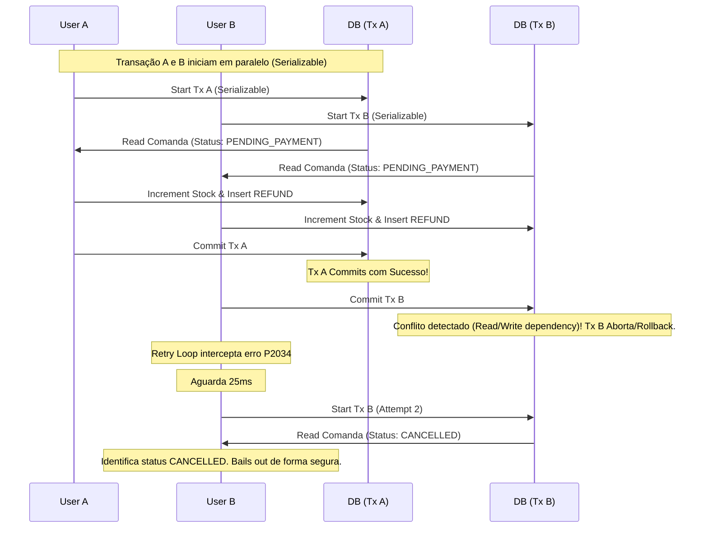
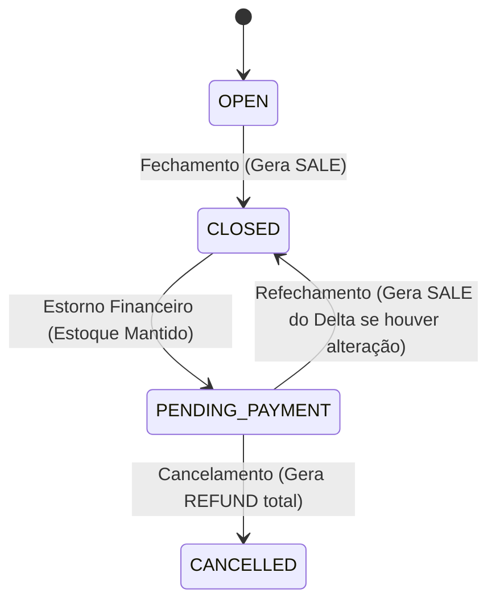

# Blueprint Técnico: Correção de Reversão de Estoque em Cancelamentos

Este documento define formalmente a arquitetura, as regras de negócio, a máquina de estados e o algoritmo para a implementação da reversão segura de estoque em cancelamentos e alterações de comandas no Tem Barber.

---

## 1. Idempotência Concorrente

A concorrência em sistemas de estoque é crítica. O modelo proposto baseia-se em **Transações Serializáveis** e detecção de conflitos em nível de banco para garantir a idempotência absoluta (execução de reversão de estoque exatamente uma vez por evento).

### Garantia de Idempotência via Isolamento SERIALIZABLE
1. **Compartilhamento de Helper**: Toda a manipulação de estoque e status de comanda utilizará a função `runSerializableTransaction`, garantindo isolamento `Serializable` real em nível de banco PostgreSQL.
2. **Máquina de Retry**: Se duas requisições concorrentes tentarem alterar o estoque ou status do mesmo item, a transação que tentar commitar por último receberá um erro de conflito de serialização (`P2034` no Prisma / `could not serialize access`).
3. **Execução desde o Início**: O catch de erro intercepta a falha, executa um curto backoff de tempo e reinicia a função callback **desde o início**.
4. **Verificação de Estado**: Na re-execução (retry), a transação relê o banco de dados. Como a primeira transação já terá commitado as alterações de estoque e status, a segunda transação detectará o novo estado (ex: item já cancelado ou com saldo revertido) e bails out (retorna no-op), garantindo que o estoque nunca seja decrementado ou incrementado em duplicidade.

### Sequência Concorrente Exemplo (Duplo Cancelamento de Comanda)



---

## 2. Ciclo de Vida do Estoque do Item (SALE → REFUND → SALE)

A premissa de que cada item possui no máximo um `SALE` e um `REFUND` é incorreta em fluxos onde a comanda pode ser reaberta por estorno, editada e fechada novamente. O estoque de um item de comanda é de natureza dinâmica.

### Definições Formais
* **Estoque Aplicado (Líquido)**: A quantidade real de estoque física que o item "segura" no momento.
  * É calculada dinamicamente pela diferença entre todas as baixas (`SALE`) e estornos (`REFUND`) associados àquele `comandaItemId`.
  * `EstoqueAplicado = Somatório(SALE.quantity) - Somatório(REFUND.quantity)`
* **Neutralização**: Ocorre quando o `EstoqueAplicado` é reduzido a zero.
* **Nova Baixa**: Se o item for reativado ou sua quantidade for aumentada em um refechamento, o sistema gerará uma nova movimentação do tipo `SALE` correspondente apenas à diferença necessária.

---

## 3. Lógica de Quantidade Alterada (Cálculo de Delta)

Ao editar a quantidade de um produto em uma comanda reaberta, a quantidade do movimento de estoque não é igual à quantidade atual do item, mas sim à **diferença (delta) entre a nova quantidade desejada e a quantidade líquida de estoque já aplicada ao item**.

### Fórmula de Movimentação
```text
Delta = QuantidadeDesejada - EstoqueAplicado
```
* Se `Delta > 0`: Significa que o operador aumentou a quantidade. É gerada uma nova movimentação do tipo `SALE` com quantidade `Delta` (e decrementa-se o estoque físico do produto em `Delta`).
* Se `Delta < 0`: Significa que o operador reduziu a quantidade ou removeu/cancelou o item. É gerada uma nova movimentação do tipo `REFUND` com quantidade `|Delta|` (e incrementa-se o estoque físico do produto em `|Delta|`).
* Se `Delta == 0`: Nenhuma movimentação é gerada.

### Exemplos de Cenários de Delta

| Cenário | Quantidade Inicial (Banco) | Estoque Aplicado Anterior | Nova Quantidade Desejada | Delta Calculado | Movimentação Gerada | Estoque Físico |
| :--- | :--- | :--- | :--- | :--- | :--- | :--- |
| **A. Exclusão Total** | 3 | 3 | 0 (Item Cancelado) | `0 - 3 = -3` | `REFUND` de 3 | Devolve +3 |
| **B. Redução (3 → 1)** | 3 | 3 | 1 | `1 - 3 = -2` | `REFUND` de 2 | Devolve +2 |
| **C. Aumento (1 → 3)** | 1 | 1 | 3 | `3 - 1 = +2` | `SALE` de 2 | Baixa -2 |
| **D. Múltiplas Edições (3 → 1 → 2)** | 3 | 1 (após red.) | 2 | `2 - 1 = +1` | `SALE` de 1 | Baixa -1 |

---

## 4. Estado de Estoque por Item (TypeScript Helper)

Para obter o estoque líquido aplicado a um item de forma determinística, utilizaremos a função abaixo. Esta função opera exclusivamente sobre os campos e tabelas reais do banco, sem assumir flags virtuais.

```typescript
async function getAppliedStockQuantityForComandaItem(
  tx: Prisma.TransactionClient,
  itemId: string
): Promise<number> {
  const movements = await tx.stockMovement.findMany({
    where: { comandaItemId: itemId },
    select: { type: true, quantity: true }
  });

  return movements.reduce((sum, m) => {
    const qty = Number(m.quantity);
    if (m.type === "SALE") return sum + qty;
    if (m.type === "REFUND") return sum - qty;
    return sum;
  }, 0);
}
```

---

## 5. Fluxo de Refechamento e Reabertura

A máquina de estados para comandas e estoque segue o seguinte fluxo:



### Prova dos Cenários de Refechamento

#### Cenário A: Refechamento Sem Alterações
1. Comanda fechada com Item A (quantidade 1): Estoque sofre `SALE` de 1. `EstoqueAplicado` = 1.
2. Estorno financeiro reabre comanda para `PENDING_PAYMENT`. Estoque permanece intacto.
3. Comanda é fechada novamente sem nenhuma alteração no Item A.
4. Lógica de delta calcula: `Delta = 1 - 1 = 0`.
5. **Resultado**: Nenhuma movimentação é criada. O estoque não sofre dupla baixa.

#### Cenário B: Remoção de Item em Comanda Reaberta
1. Comanda fechada com Item A (quantidade 1): Estoque sofre `SALE` de 1. `EstoqueAplicado` = 1.
2. Estorno financeiro reabre comanda para `PENDING_PAYMENT`.
3. Operador remove Item A (ou altera status para `CANCELLED`).
4. Lógica de delta calcula: `Delta = 0 - 1 = -1`.
5. **Resultado**: É gerado um `REFUND` de 1 e o estoque do produto é incrementado em 1.

#### Cenário C: Item Volta a ser Vendido
1. Comanda cancelada ou item removido: Gerou `REFUND` total. `EstoqueAplicado` = 0.
2. Item é reativado ou reinserido com quantidade 1.
3. Comanda é fechada.
4. Lógica de delta calcula: `Delta = 1 - 0 = +1`.
5. **Resultado**: É gerada nova `SALE` de 1 e decrementado 1 unidade do estoque físico.

---

## 6. Análise de Concorrência Passo a Passo

### Cenário 1: Cancelamento A e B Simultâneos
1. **Locks**: Ambas as transações obtêm um lock compartilhado de leitura sobre a comanda e os itens.
2. **Snapshot**: Ambas veem a comanda como `PENDING_PAYMENT`.
3. **Conflito**: Ambas tentam atualizar a comanda para `CANCELLED` e inserir o `REFUND` na tabela `stock_movements`.
4. **Retry**: A transação A commita com sucesso. A transação B detecta falha de serialização (`P2034`) ao tentar commitar devido à colisão de escrita, sofre rollback total e reinicia o loop.
5. **Resultado**: Na segunda tentativa, a transação B lê a comanda já como `CANCELLED`, ignora a lógica e retorna no-op de sucesso.

### Cenário 2: DELETE Item + Cancelar Comanda Simultâneos
1. **Locks**: Transação A (DELETE) lê o item X. Transação B (Cancelar Comanda) lê todos os itens (incluindo X) e a comanda.
2. **Snapshot**: Ambas veem o item X ativo com `EstoqueAplicado = 1`.
3. **Conflito**: Transação A atualiza o item X para `CANCELLED` e insere `REFUND` de 1. Transação B tenta atualizar todos os itens para `CANCELLED` e inserir `REFUND` para todos.
4. **Retry**: A transação que commita por último sofre falha de serialização e sofre rollback completo. Se a Transação B falhar, ela reinicia.
5. **Resultado**: Na re-execução, a Transação B lê o item X já como `CANCELLED` (e `EstoqueAplicado = 0`). Ela processará apenas os outros itens ativos, inserindo `REFUND` apenas neles, evitando dupla reversão do item X.

### Cenário 3: Fechamento + Cancelamento Simultâneos
1. **Locks**: Transação A (Fechar) lê itens e pagamentos. Transação B (Cancelar) lê itens e comanda.
2. **Snapshot**: Ambas veem a comanda como `PENDING_PAYMENT`.
3. **Conflito**: Transação A tenta fechar a comanda (`CLOSED`) e gravar `SALE`. Transação B tenta cancelar a comanda (`CANCELLED`) e gravar `REFUND`.
4. **Retry**: Uma das duas transações commita primeiro (ex: Fechamento). A outra transação (Cancelamento) falha devido à alteração concorrente na linha da comanda.
5. **Resultado**: Ao reiniciar a transação de cancelamento, o callback lê o novo status `CLOSED` da comanda. Como a transição de `CLOSED` para `CANCELLED` não é permitida pela máquina de estados, a transação falha com `INVALID_TRANSITION` de forma segura.

---

## 7. Integração Financeira, Comissões e Clube

Para clareza regulatória da auditoria, as responsabilidades de negócio são estritamente separadas:

1. **Estoque**: Gerenciado por `Product.currentStock` e `StockMovement`.
2. **Comissão**: Gerenciada por `CommissionEntry`. Atualizada por `syncCommissionReleaseForComanda`. **Não tem impacto ou responsabilidade sobre a consistência financeira de caixa**.
3. **Clube**: Gerenciado por `ClubBenefitUsage`. Estornado por `reverseClubBenefitUsage` na mesma transação de cancelamento do item.
4. **Pagamentos e Caixa**: Registrados em `Payment` e `CashMovement`. **O cancelamento de uma comanda ou exclusão de item não gera estornos automáticos de valores**. O estorno de pagamentos deve ser feito pelo operador e, caso reabra a comanda, o estoque continuará baixado até que alterações físicas ocorram.

---

## 8. Avaliação sobre Migration

* **Migration necessária?**: **NÃO**.
* **Prova técnica**: O banco de dados PostgreSQL com transações serializadas e retries automáticos fornece garantia forte contra condições de corrida e dupla reversão. O cálculo do delta de estoque por item (`getAppliedStockQuantityForComandaItem`) elimina qualquer necessidade de novas colunas ou constraints no schema, permitindo ciclos complexos de edições (`SALE -> REFUND -> SALE`) com o schema atual intacto.

---

## 9. Suíte de Testes Adicionais Obrigatórios

A implementação da correção deverá conter cobertura de testes cobrindo os seguintes casos:

1. **Dois cancelamentos simultâneos**: Simulação de concorrência com erro de serialização resultando em apenas um `REFUND` líquido.
2. **DELETE item + cancelamento simultâneos**: Verificação de que não ocorre dupla reversão do item deletado.
3. **Ciclo SALE → REFUND → nova SALE**: Validação de reabertura, cancelamento e re-fechamento do mesmo item.
4. **Refechamento sem alteração**: Comprovação de que não há geração de novas movimentações `SALE`.
5. **Redução de quantidade (3 → 1)**: Verificação de geração de `REFUND` de 2.
6. **Aumento de quantidade (1 → 3)**: Verificação de geração de `SALE` de 2.
7. **Múltiplas alterações (3 → 1 → 2)**: Garantia de saldo líquido de estoque correto.
8. **Reversão baseada em movimentos**: Garantia de que a reversão calcula o estoque aplicado real do banco em vez da propriedade `quantity` em memória do item.
9. **Retry SERIALIZABLE**: Teste unitário forçando erro de escrita concorrente e atestando o retry com sucesso.
10. **Falha e Rollback**: Garantia de que se a atualização de `currentStock` falhar, a criação de `StockMovement` sofre rollback completo.

---

## 10. Status do Blueprint

* **Status**: **GO** (Pronto para implementação física da lógica de reversão e testes).
